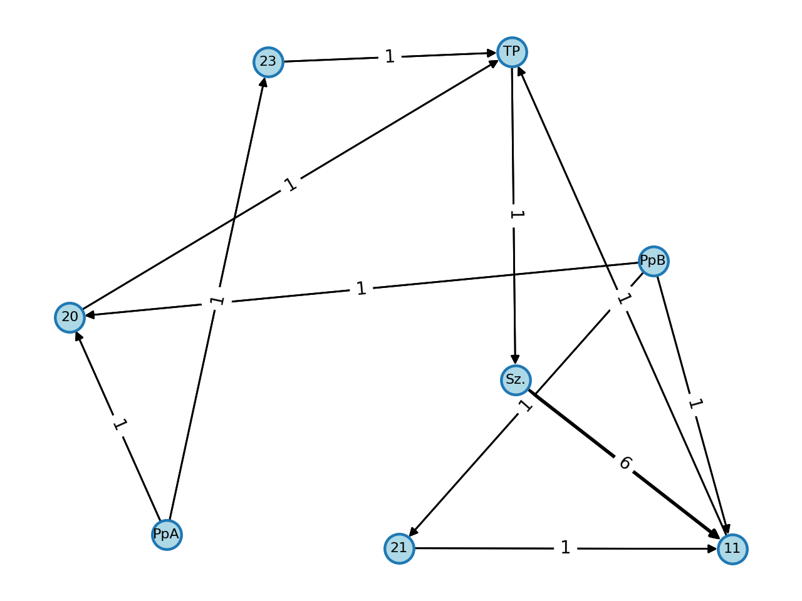

# hyBit Modellierungsvorhaben Graph
Python-Skripte zur automatischen Erstellung eines Graphen der hyBit-Modellierungsvorhaben.



### Idee
Die Modellierungsvorhaben aus dem Workshop haben diverse Beziehungen untereinander. 
Es könnte hilfreich sein, wenn wir das entsprechend visualisieren, damit wird bisher 
unbekannte Beziehungen zwischen den Modellierungsvorhaben einfach sehen können.

Diese Repo implementiert eine einfache Logik, welche die Daten aus einer Excel-Tabelle 
ähnlich der im Workshop liest und entsprechend visualisiert.
Dazu sind allerdings zwei zusätzliche Spalten (Quelle und Senke) notwendig.
Diese decken sich allerdings voraussichtlich mit Woher und Wohin, sollen das aber nochmal
explizit auf IDs festlegen.

Für die Senke können mehrere IDs, die mittels Semikolon (;) getrennt sind, angegeben 
werden. Diese werden für den Graph dann entsprechend getrennt.

### Hinweise
Für die Darstellung wird networkx und matplotlib genutzt. Für das Lesen der
Excel-Datei matplotlib.

Die Dicke der Pfeile lässt sich skalieren. Dazu einfach den Faktor WIDTH_SCALING_FACTOR
in der draw_nx.py anpassen.

Die Platzierung ist möglicherweise nicht optimal und auf jeden Fall auch nicht stabil.
NetworkX berechnet da jeweils eine neue Zusammenstellung.

### Installation
Installiere die Python-Bibliotheken mittels
```
$ pip3 install -r requirements.txt --user
```

Anschließend können die Skripte ausgeführt werden.
```
$ python3 print_graph_data.py
Missing sink id in F14, line ignored
Missing source id in C21, line ignored
[...]
Nodes: 
- Szenario (0 in, 12 out)
- 11 (13 in, 0 out)
[...]
Edges Weights:
From Szenario
        11: 12
[...]
Edges: 
Szenario - 11: Verfügbarkeit von Wasserstoff
Szenario - 11: Szenario
Szenario - 11: Szenario
[...]
$ python3 draw_nx.py  
Created network.pdf; you might open it using e.g. evince network.pdf
$ evince network.pdf 
$ 
```
